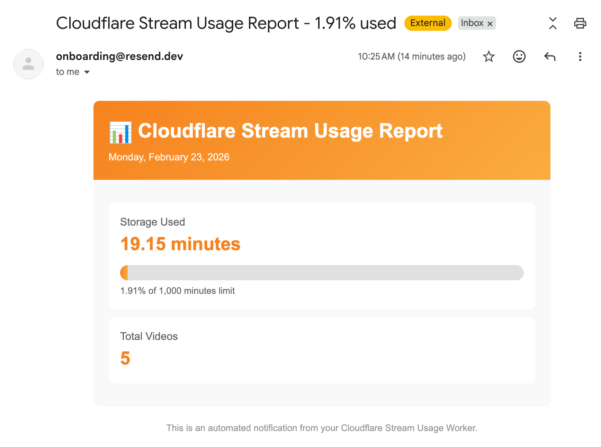

# Cloudflare Stream Usage Notification Worker

A Cloudflare Worker that runs on a **daily cron schedule** to monitor your Cloudflare Stream storage usage and sends email notifications via [Resend](https://resend.com).

[](https://deploy.workers.cloudflare.com/?url=https://github.com/nrlzmn/stream-usage)

## Features

- **Scheduled execution**: Runs daily at midnight UTC (configurable via cron)
- **Stream usage monitoring**: Fetches video count, storage minutes used, and storage limit
- **Email notifications**: Sends a styled HTML email report via Resend API
- **Usage warnings**: Alerts when storage exceeds 80% of the limit
- **Manual testing**: HTTP endpoint to trigger notifications on-demand

## Example Email Notification



## APIs Used

| API | Purpose | Documentation |
|-----|---------|---------------|
| **Cloudflare Stream API** | Fetch storage usage data | [Stream Storage Usage](https://developers.cloudflare.com/api/resources/stream/subresources/videos/methods/storage_usage/) |
| **Resend API** | Send email notifications | [Resend Send Email](https://resend.com/docs/api-reference/emails/send-email) |

## Required Secrets

After deploying, configure these secrets using `wrangler secret put <NAME>`:

| Secret | Description |
|--------|-------------|
| `CF_API_TOKEN` | Cloudflare API token with **Stream Read** permission. [Create token](https://dash.cloudflare.com/profile/api-tokens) |
| `CF_ACCOUNT_ID` | Your Cloudflare Account ID (found in dashboard URL or Workers overview) |
| `RESEND_API_KEY` | Resend API key. [Get API key](https://resend.com/api-keys) |
| `NOTIFICATION_EMAIL` | Email address to receive notifications |
| `FROM_EMAIL` | Sender email address (must be verified in Resend, or use `onboarding@resend.dev` for testing) |

```bash
npx wrangler secret put CF_API_TOKEN
npx wrangler secret put CF_ACCOUNT_ID
npx wrangler secret put RESEND_API_KEY
npx wrangler secret put NOTIFICATION_EMAIL
npx wrangler secret put FROM_EMAIL
```

## Local Development

1. Clone and install dependencies:
   ```bash
   npm install
   ```

2. Create a `.dev.vars` file with your secrets:
   ```
   CF_API_TOKEN=your_cloudflare_api_token
   CF_ACCOUNT_ID=your_account_id
   RESEND_API_KEY=re_xxxxxxxxx
   NOTIFICATION_EMAIL=you@example.com
   FROM_EMAIL=onboarding@resend.dev
   ```

3. Start the dev server:
   ```bash
   npm run dev
   ```

## Testing

You don't need to wait for the cron schedule to test the worker. Use one of these methods:

### Via HTTP Endpoint (Recommended)

After deploying, trigger a test notification:

```bash
curl https://your-worker.your-subdomain.workers.dev/test
```

Or locally:
```bash
curl http://localhost:8787/test
```

### Via Scheduled Handler (Local)

Trigger the cron handler locally:

```bash
curl "http://localhost:8787/__scheduled?cron=0+0+*+*+*"
```

## Cron Schedule

The worker runs daily at midnight UTC. To change the schedule, edit `wrangler.jsonc`:

```jsonc
"triggers": {
  "crons": ["0 0 * * *"]  // Default: daily at midnight UTC
}
```

Common cron patterns:
- `0 0 * * *` - Daily at midnight UTC
- `0 */6 * * *` - Every 6 hours
- `0 9 * * 1` - Every Monday at 9 AM UTC

## Alternative: Using Webhooks

While this worker uses Resend for email notifications, you can modify it to send notifications via webhooks instead. Replace the `sendEmailNotification` function with a webhook call:

```javascript
async function sendWebhookNotification(webhookUrl, usageData) {
  const response = await fetch(webhookUrl, {
    method: 'POST',
    headers: { 'Content-Type': 'application/json' },
    body: JSON.stringify({
      type: 'stream_usage_report',
      data: usageData,
      timestamp: new Date().toISOString(),
    }),
  });
  return response.json();
}
```

This allows integration with Slack, Discord, Microsoft Teams, or any webhook-compatible service.

## Deploy

```bash
npx wrangler deploy
```
